# V-Bounce OS — System Overview

A structured framework for building production-ready software with AI agents. Three phases, six agents, one process.

---

## The Three Phases

**Phase 1** produces the planning documents. **Phase 2** is the bounce loop — agents implement, test, and audit each story. **Phase 3** is human review, release, and lessons learned.

---

## Document Hierarchy

Every document inherits from the level above. No level can be skipped.

```mermaid
flowchart TB
    C["📋 Charter\nWHY — vision, principles, stack"]
    R["🗺️ Roadmap\nWHAT/WHEN — releases, ADRs"]
    E["📦 Epic\nWHAT — scoped feature"]
    S["📝 Story\nHOW — spec, tests, impl guide"]
    D["📅 Delivery Plan\nEXECUTION — sprints, states"]
    RR["⚠️ Risk Registry\nCROSS-CUTTING — all levels feed in"]

    C --> R --> E --> S --> D
    C & R & E -.-> RR
```

All documents live in `product_plans/`. Each delivery (release) gets a folder. Epics are subfolders. Stories live inside their Epic folder. Completed deliveries archive to `product_plans/archive/`.

---

## The Six Agents

```mermaid
flowchart TB
    H["👤 Human\nOwns planning docs\nApproves sprints"]
    TL["🎯 Team Lead\nOrchestrates, never codes"]

    DEV["🔨 Developer\nImplements features"]
    QA["🧪 QA\nValidates (no edit)"]
    ARCH["🏛️ Architect\nAudits (no edit)"]
    OPS["🚀 DevOps\nMerges & deploys"]
    SC["📖 Scribe\nGenerates docs"]

    H <-->|"Approvals\n& reports"| TL
    TL -->|delegates| DEV & QA & ARCH & OPS & SC
```

Agents communicate **only through structured reports** — never directly with each other. The Team Lead reads reports and delegates the next step.

---

## Story State Machine

Each story moves through these states during a sprint:

"Bouncing" is where the Dev ↔ QA loop happens. QA and Architect each have independent bounce counters — 3 failures on either gate triggers escalation.

---

## The Bounce Loop (Phase 2)

This is the core of the system — the report-driven implementation cycle:

```mermaid
sequenceDiagram
    participant TL as 🎯 Lead
    participant DEV as 🔨 Dev
    participant QA as 🧪 QA
    participant ARCH as 🏛️ Arch
    participant OPS as 🚀 DevOps

    TL->>DEV: Story spec + task file
    DEV-->>TL: Implementation Report

    TL->>QA: Dev Report + acceptance criteria
    alt QA Fail
        QA-->>TL: Bug Report
        TL->>DEV: Bounce back (repeat)
    else QA Pass
        QA-->>TL: Validation Report
    end

    TL->>ARCH: All reports + ADRs
    ARCH-->>TL: Audit Report (pass/fail)

    TL->>OPS: Gate reports
    OPS-->>TL: Merge Report
```

Each story runs in an **isolated git worktree** so agents working on different stories can never interfere with each other.

**For L1 Trivial Tasks**, the Team Lead can bypass the Epic/Story hierarchy and the QA/Architect bounce loop entirely by using the **Hotfix Path**. The Developer still implements the fix (Phase 2 work), but QA and Architect gates are replaced by a single manual Human verification. The Hotfix specifies the exact fix for 1-2 files, the Developer implements it, and the Human verifies before staging.

---

## Git Branching

Three levels: **main** (production) → **sprint branch** (integration) → **story branches** (worktrees). Stories merge into sprint after gates pass. Sprint merges into main after human review.

---

## Sprint Lifecycle

A sprint from start to finish:

```mermaid
flowchart TB
    S0["Step 0: Triage\nStandard (L2-L4) vs\nHotfix (L1) Path"]
    S1["Step 1: Init Stories\nCreate worktrees,\nbuild task files"]
    S2["Steps 2-4: Bounce\nDev → QA → Architect\n(loop until pass)"]
    S5["Step 5: Story Merge\nDevOps merges each story\ninto sprint branch"]
    S6["Step 6: Integration Audit\nHotfix Audit script +\nArchitect Deep Audit"]
    S7["Step 7: Consolidation\nSprint Report → Human review\n→ Release → Lessons → Scribe"]

    S0 -->|"Standard"| S1
    S0 -->|"Hotfix\n(Dev + Human verify)"| S7
    S1 --> S2 --> S5 --> S6 --> S7
    S2 -->|"bounce\nback"| S2
```

After all sprints in a delivery complete, the Team Lead archives the delivery folder and adds a Delivery Log entry to the Roadmap.

---

## Delivery Lifecycle

```mermaid
flowchart LR
    Plan["📋 Plan\nCharter → Roadmap\n→ Epics → Stories"]
    Sprint["🔄 Sprint(s)\nBounce stories\nthrough gates"]
    Release["🚀 Release\nMerge to main\nTag version"]
    Archive["📦 Archive\nMove delivery folder\nLog in Roadmap §7"]

    Plan --> Sprint --> Release --> Archive
    Sprint -->|"next sprint"| Sprint
```

A **delivery = a Roadmap release**. It contains one or more sprints. When all sprints are done, the whole delivery folder moves to `product_plans/archive/` and gets a Delivery Log entry with release notes and metrics.

---

## File Reference

| What | Where |
|------|-------|
| Setup guide | `brains/SETUP.md` |
| Brain files | `brains/CLAUDE.md`, `AGENTS.md`, `GEMINI.md`, `cursor-rules/` |
| Agent configs | `brains/claude-agents/*.md` |
| Document templates | `templates/*.md` |
| Skills | `skills/*/SKILL.md` |
| Scripts | `scripts/*.sh` (Automations like `hotfix_manager.sh`) |
| Planning documents | `product_plans/` |
| Sprint history (committed) | `.bounce/archive/` |
| Product documentation | `product_documentation/` |
| Detailed diagrams | `diagrams/*.mermaid` |
| Edge Cases & Reference | `docs/HOTFIX_EDGE_CASES.md`, etc. |
