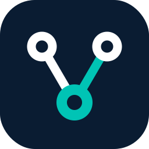
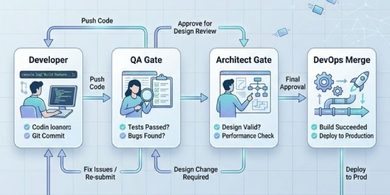

<div align="center">
  
  <h1>V-Bounce Engine</h1>
  <p><strong>Stop babysitting your AI. Build a disciplined, self-correcting engineering team.</strong></p>

  <p>
    <a href="https://github.com/sandrinio/v-bounce-engine/blob/main/LICENSE"></a>
    <a href="https://www.npmjs.com/package/@sandrinio/vbounce"></a>
  </p>
  
  <p>
    V-Bounce Engine turns your single AI assistant — <b>Claude Code, Cursor, Gemini, Copilot</b> — into a fully equipped engineering team. It enforces a planning-first workflow, automated quality gates, structural audits, and a persistent learning loop.
  </p>
</div>

---

##  Quick Start

Get your new AI team up and running in seconds. No complex setup, no vector databases. Just plain Markdown and Node.

```bash
# 1. Install the framework for your platform of choice
npx @sandrinio/vbounce install claude    # Claude Code (Full Orchestration)
# Or: npx @sandrinio/vbounce install cursor|gemini|codex|vscode

# 2. Verify your installation
npx vbounce doctor

# 3. Initialize your first sprint!
npx vbounce sprint init S-01 D-01
```

> **Requirements**: Node.js and a project directory. That's it. One person to set the vision, the AI handles the execution.

---

##  The Problem: AI Chaos

AI coding tools are incredibly fast, but without guardrails, they create **expensive chaos**:
- **No accountability:** Code ships with bugs a junior dev would catch.
- **Invisible progress:** "The agent is still running." No milestones, no checks.
- **Goldfish memory:** Every session is Day 1. It makes the same architectural mistake twice.
- **Infinite loops:** The agent gets stuck trying to fix its own broken code.

---

##  Why V-Bounce Engine?

V-Bounce wraps your AI agents in the same discipline that makes human engineering teams reliable:

| Guardrail | What It Solves |
|-------------|-------------------|
| **Isolated Worktrees** | **Contamination.** Every story is a sandbox. One bad story won't break your app. |
| **QA Quality Gates** | **Missed Requirements.** Code is validated against Acceptance Criteria *before* merge. |
| **Architect Audits** | **Drift.** Blocks the AI from hallucinating new dependencies or breaking patterns. |
| **3-Bounce Escalation** | **Infinite Loops.** After 3 failed attempts, the AI surfaces the root cause to you. |
| **Persistent Lessons** | **Goldfish Memory.** The AI logs mistakes in `LESSONS.md` and reads them next sprint. |

---

##  The "Bounce" Loop

Instead of letting an AI hallucinate straight to production, V-Bounce coordinates specialized roles working in isolation.

<div align="center">
  
</div>

1.  **Developer**: Implements features in isolated git worktrees.
2.  **QA**: Validates code strictly against acceptance criteria. (Read-only)
3.  **Architect**: Audits code against ADRs (Architecture Decision Records). (Read-only)
4.  **DevOps**: Merges passing code cleanly to the sprint branch.
5.  **Scribe**: Keeps product documentation in sync with actual code.

---

##  Measure What Matters (Metrics)

For the first time, manage your AI work like a true Product Manager. Run `vbounce trends` to track:
- **Bounce Rate (QA / Architect)**: How often does the AI fail to meet spec?
- **Correction Tax**: How much manual human intervention was required? (0% = AI shipped autonomously).
- **Escalation Rate**: How often did stories hit the 3-bounce limit?

---

##  Supported Platforms

V-Bounce adapts to your current workflow effortlessly.

- **Claude Code (Tier 1)**: Full orchestration. Spawns specific subagents for each role seamlessly.
- **Gemini CLI / Codex (Tier 2)**: Single-agent mode, following the strict sequential bounce loop.
- **Cursor (Tier 3)**: Deep integration via modular `.cursor/rules/` MDC mapping.
- **Copilot / Windsurf (Tier 4)**: Embedded awareness through checklists and state reading.

---

##  Deep Dive & Docs

Ready to see how deep the rabbit hole goes?
- **[System Overview & Architecture](OVERVIEW.md)**
- **[Epic and Story Templates](templates/epic.md)**
- **[Self-Improvement Pipeline (`vbounce improve`)](IMPROVEMENT_PLAN.md)** *(Your AI optimizes its own framework)*

---

<div align="center">
  <b>Built for builders who want to ship, not babysit.</b><br>
  <i>Contributions, issues, and feature requests are welcome!</i>
</div>
