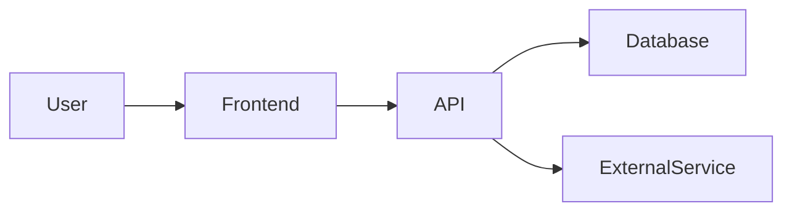

<instructions>
FOLLOW THIS EXACT STRUCTURE. Output sections in order 1-9.

1. **Header**: Set Status, Ambiguity Score, Readiness based on completeness
2. **§1 Project Identity**: What it is, what it's NOT, success metrics
3. **§2 Design Principles**: 3-5 numbered rules (these guide all future decisions)
4. **§3 Architecture**: System diagram + Tech Stack table (mark unknown as `[TBD]`)
5. **§4 Core Entities**: Table of data objects (nouns)
6. **§5 Key Workflows**: Numbered steps for main flows (verbs)
7. **§6 Constraints**: Known limitations and mitigations
8. **§7 Open Questions**: Unanswered items that may block progress
9. **§8-9 Glossary & References**: Terms and links

Ambiguity Score:
- 🔴 High: Missing "why" or primary flow → Blocked
- 🟡 Medium: Tech TBD but logic clear → Ready for Roadmap
- 🟢 Low: All filled → Ready for Epics

Output location: `product_plans/{project}_charter.md`

Document Hierarchy Position: ROOT
Charter is the source of truth for WHY. All downstream documents inherit from it:
Charter (why) → Roadmap (strategic what/when) → Epic (detailed what) → Story (how) → Delivery Plan (execution) → Risk Registry (risks)

Downstream consumers:
- Roadmap §1 pulls Vision, Goal, Users, and Success Metrics from Charter §1
- Roadmap §3 ADRs are constrained by Charter §3 Tech Stack choices
- Epic §1 Problem & Value traces back to Charter §1.1 and §5 Workflows
- Design Principles (§2) are referenced by ALL agents when making ambiguous decisions

Do NOT output these instructions.
</instructions>

# Project Charter: [Project Name]

> **Status**: 🌱 Initial Draft / 🌿 Refining / 🌳 Approved
> **Ambiguity Score**: 🔴 High / 🟡 Medium / 🟢 Low
> **Readiness**: Blocked / Ready for Roadmap / Ready for Epics

---

## 1. Project Identity

### 1.1 What It Is
> One paragraph: what the product does and for whom.

### 1.2 What It Is NOT
> Explicit boundaries. Prevents scope creep and AI hallucination.
- Not a {similar product X}
- Does not handle {out-of-scope capability}

### 1.3 Success Definition
> How do we know we won? Measurable outcomes.
- {Metric 1}
- {Metric 2}

---

## 2. Design Principles
> Numbered rules that guide ALL decisions. AI agents reference these when uncertain.

1. **{Principle Name}**: {One sentence explanation}
2. **{Principle Name}**: {One sentence explanation}
3. **{Principle Name}**: {One sentence explanation}

---

## 3. Architecture Overview

### 3.1 System Context

### 3.2 Technical Foundation
| Component | Choice | Status | Notes |
|-----------|--------|--------|-------|
| **Frontend** | {e.g. Next.js} | Selected / TBD | {Reasoning} |
| **Backend** | {e.g. Python/FastAPI} | Selected / TBD | |
| **Database** | {e.g. Supabase} | Selected / TBD | |
| **AI/ML** | {e.g. Claude API} | Selected / TBD | |
| **Integrations** | {List External APIs} | Selected / TBD | |

---

## 4. Core Entities
> The nouns of your system. AI uses this to understand data flow.

| Entity | Purpose | Key Fields |
|--------|---------|------------|
| User | Account holder | id, email, role |
| {Entity} | {purpose} | {fields} |

---

## 5. Key Workflows
> The verbs of your system. Reference these in Epics.

### 5.1 {Workflow Name}
1. {Step}
2. {Step}
3. {Step}

### 5.2 {Workflow Name}
1. {Step}
2. {Step}

---

## 6. Constraints & Edge Cases
| Constraint | Mitigation |
|------------|------------|
| {e.g., Rate limits on external API} | {how we handle it} |
| {e.g., Offline support required} | {approach} |
| {e.g., GDPR compliance} | {approach} |

---

## 7. Open Questions

> [!QUESTION]
> {Question that blocks progress}

| Question | Options | Impact | Status |
|----------|---------|--------|--------|
| {decision needed} | A: {x}, B: {y} | Blocks {X} | Open / Decided |

---

## 8. Glossary
| Term | Definition |
|------|------------|
| {term} | {what it means in THIS project} |

---

## 9. References
- Design Docs: {link}
- Competitor Analysis: {link}
- User Research: {link}
