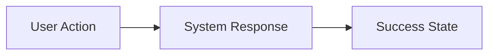

<instructions>
FOLLOW THIS EXACT STRUCTURE. Output sections in order.

1. **Metadata Table**: Status, Ambiguity, Priority, Owner, Tags, Target Date
2. **§1 Problem & Value**: Why (problem), What (solution), Success Metrics
3. **§2 Scope Boundaries**: IN-SCOPE checkboxes, OUT-OF-SCOPE list
4. **§3 Context**: Personas, User Journey diagram, Constraints table
5. **§4 Technical Context**: Affected files, Dependencies, Integrations, Data changes
6. **§5 Decomposition Guidance**: Story categories checklist + suggested sequence
7. **§6 Risks & Edge Cases**: Risk table with mitigations
8. **§7 Acceptance Criteria**: Gherkin scenarios (happy path + error case)
9. **§8 Open Questions**: Blocking decisions table
10. **§9 Artifact Links**: Stories list + references

Ambiguity Score:
- 🔴 High: Scope unclear → Needs refinement
- 🟡 Medium: Scope clear, tech TBD → Ready for decomposition
- 🟢 Low: All filled → Ready for Stories

Output location: `product_plans/{delivery}/EPIC-{NNN}_{epic_name}/EPIC-{NNN}.md`

Document Hierarchy Position: LEVEL 3 (Charter → Roadmap → **Epic** → Story)

Upstream sources:
- §1 Problem & Value traces to Charter §1.1 (What It Is) and §5 (Key Workflows)
- §3.3 Constraints inherits from Charter §6 and Roadmap §5 Strategic Constraints
- §4 Technical Context references Roadmap §3 ADRs for architecture decisions
- Metadata.Priority aligns with Roadmap §2 Release Plan epic priorities

Downstream consumers:
- Stories are decomposed from §5 Decomposition Guidance
- Story §1 The Spec inherits from Epic §2 Scope Boundaries
- Story §3 Implementation Guide references Epic §4 Technical Context
- Delivery Plan §3 Active Sprint pulls stories linked in §9 Artifact Links
- Risk Registry §1 Active Risks may reference Epic §6 Risks

Do NOT output these instructions.
</instructions>

# EPIC-{ID}: {Epic Name}

## Metadata
| Field | Value |
|-------|-------|
| **Status** | Draft / Ready / In Progress / Done |
| **Ambiguity** | 🔴 High / 🟡 Medium / 🟢 Low |
| **Context Source** | Charter §{section} / Roadmap §{section} / User Input |
| **Release** | {Release name from Roadmap §2} |
| **Owner** | {PM/PO name} |
| **Priority** | P0 - Critical / P1 - High / P2 - Medium |
| **Tags** | #frontend, #api, #auth |
| **Target Date** | {YYYY-MM-DD} |

---

## 1. Problem & Value
> Target Audience: Stakeholders, Business Sponsors

### 1.1 The Problem
> 1-2 sentences. Why are we doing this?

### 1.2 The Solution
> High-level what we're building.

### 1.3 Success Metrics (North Star)
- {Measurable outcome 1}
- {Measurable outcome 2}

---

## 2. Scope Boundaries
> Target Audience: AI Agents (Critical for preventing hallucinations)

### ✅ IN-SCOPE (Build This)
- [ ] {Capability 1}
- [ ] {Capability 2}
- [ ] {Capability 3}

### ❌ OUT-OF-SCOPE (Do NOT Build This)
- {Explicitly excluded capability}
- {Deferred to EPIC-XXX}

---

## 3. Context

### 3.1 User Personas
- **{Persona A}**: {Role} - {Primary Goal}
- **{Persona B}**: {Role} - {Primary Goal}

### 3.2 User Journey (Happy Path)


### 3.3 Constraints
| Type | Constraint |
|------|------------|
| **Performance** | {e.g., Must complete in < 200ms} |
| **Security** | {e.g., GDPR compliant, no PII logging} |
| **Tech Stack** | {e.g., Must use existing UserAPI v2} |

---

## 4. Technical Context
> Target Audience: AI Agents - READ THIS before decomposing.

### 4.1 Affected Areas
| Area | Files/Modules | Change Type |
|------|---------------|-------------|
| API | `src/api/{file}.ts` | New / Modify |
| Database | `prisma/schema.prisma` | Add table / Modify |
| UI | `src/components/` | New component |
| Config | `.env`, `config/` | Add vars |

### 4.2 Dependencies
| Type | Dependency | Status |
|------|------------|--------|
| **Requires** | EPIC-{ID}: {name} | Done / In Progress / Blocked |
| **Unlocks** | EPIC-{ID}: {name} | Waiting |

### 4.3 Integration Points
| System | Purpose | Docs |
|--------|---------|------|
| {External API} | {what we use it for} | {link} |

### 4.4 Data Changes
| Entity | Change | Fields |
|--------|--------|--------|
| {Entity} | NEW | id, name, ... |
| {Entity} | MODIFY | + new_field |

---

## 5. Decomposition Guidance
> Hints for AI story breakdown. Check all that apply.

- [ ] **Schema/Migration** - Database changes, new tables/fields
- [ ] **API Work** - New/modified endpoints
- [ ] **UI Work** - New screens or components
- [ ] **Integration** - External service connection
- [ ] **Infrastructure** - Config, env vars, deployment
- [ ] **Testing** - E2E, integration tests
- [ ] **Documentation** - User-facing or API docs

### Suggested Story Sequence
1. {First: usually schema/data layer}
2. {Then: API/backend layer}
3. {Then: UI/frontend layer}
4. {Finally: integration + E2E tests}

---

## 6. Risks & Edge Cases
| Risk | Likelihood | Mitigation |
|------|------------|------------|
| {e.g., Email delivery delay} | Medium | {e.g., "Resend" button after 30s} |
| {e.g., Rate limiting hit} | Low | {e.g., Exponential backoff} |

---

## 7. Acceptance Criteria (Epic-Level)
> How do we know the EPIC is complete? Full user flow.

```gherkin
Feature: {Epic Name}

  Scenario: Complete Happy Path
    Given {precondition - user state}
    When {user completes full flow}
    Then {end-to-end outcome achieved}
    And {data persisted correctly}

  Scenario: Key Error Case
    Given {precondition}
    When {error condition}
    Then {graceful handling}
```

---

## 8. Open Questions
| Question | Options | Impact | Owner | Status |
|----------|---------|--------|-------|--------|
| {decision needed} | A: {x}, B: {y} | Blocks {stories X,Y} | {name} | Open / Decided |

---

## 9. Artifact Links
> Auto-populated as Epic is decomposed.

**Stories:**
- [ ] STORY-{ID}-01: {name}
- [ ] STORY-{ID}-02: {name}

**References:**
- Charter: [PROJECT CHARTER](link)
- Design: {link}
- API Spec: {link}
